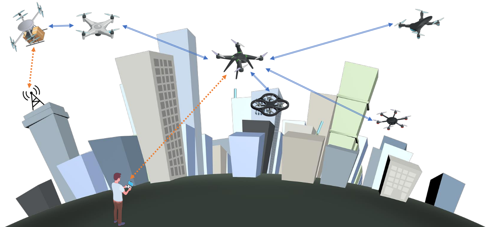
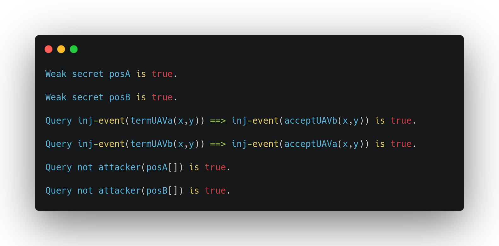

# Lightweight Privacy-Preserving Proximity Discovery for Remotely-Controlled Drones

Our solution, namely Lightweight Privacy-Preserving Proximity Discovery for Remotely-Controlled Drones (``LPPD``), allows two directly-connected UAV/drones, in mutual radio visibility, to know if they are in proximity, i.e., at risk of immediate physical collision, without revealing their actual location.

<p align="center">
  
</p>

The details are provided in the paper.

## Formal verification with ProVerif
The security properties of ``LPPD`` have been verified formally and experimentally by using the open-source tool ProVerif 2.02pl1, demonstrating enhanced security protection with respect to state-of-the-art approaches.

In order to test the security properties, download the file ```lppd.pv``` and run: ```./proverif lppd.pv | grep "RESULT"```.
Further, in order to verify that the location is a strong secret (i.e. the attacker cannot launch offline guessing attacks on the location value), please follow the guidelines inside the code.

<p align="center">
  
</p>

## Accuracy and Performance Tests

MATLAB version: R2022b or higher
Download: https://it.mathworks.com/downloads/?s_tid=rh_bn_dl

### Accuracy Test
In order to verify and extract the risults depicted in Fig. 4 (Proximity Detection Ratio of LPPD, varying the radius of the sphere 𝑟𝛼 used for space tessellation), you need to run the file ```lppd_accuracy_test.m``` in the folder accuracy_test.
Please, the scripts to generate the data for this simulation, it requires time.

### Performance Test
In order to extract the:
1) Time to execute modular operations on the 3DR-Solo, considering different RSA key lengths
2) Time to execute LPPD on the 3DR-Solo, with different key sizes
3) No. of messages required to execute LPPD between two UAVs
4) Energy for executing LPPD on the 3DR-Solo, based on key size

Please run the file ```lppd.m``` inside the folder performance_test.

## Contributing
Pull requests are welcome. For major changes, please open an issue first to discuss what you would like to change.

## License
``LPPD`` is released under the GNU General Public License v3.0 license.
